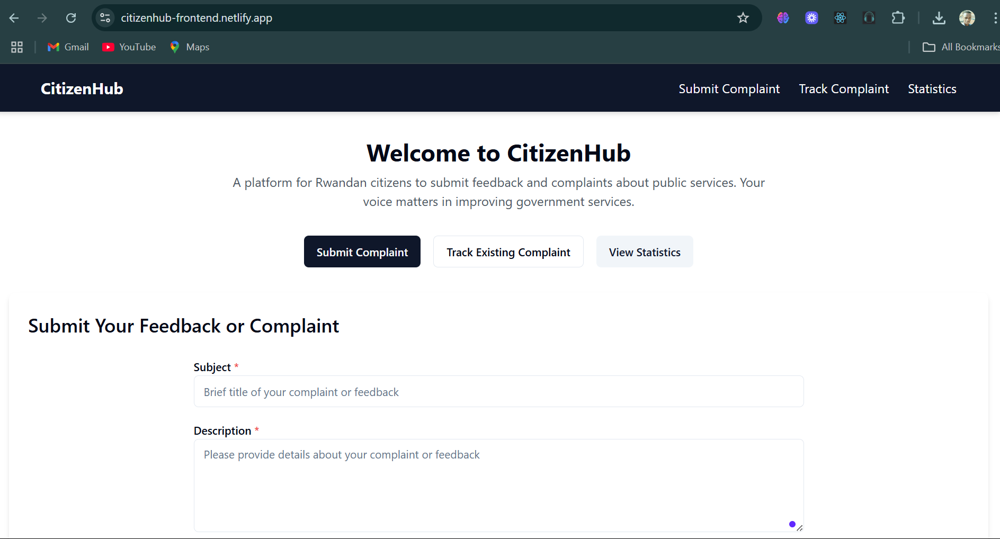
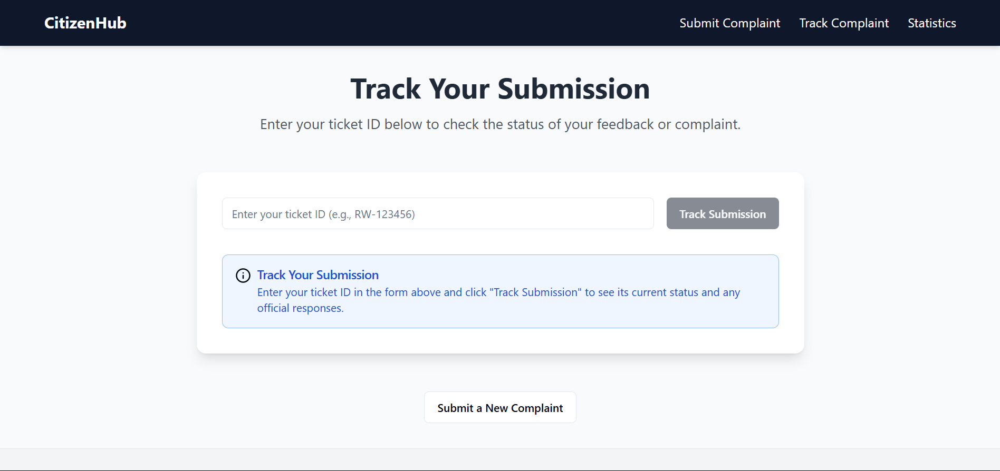
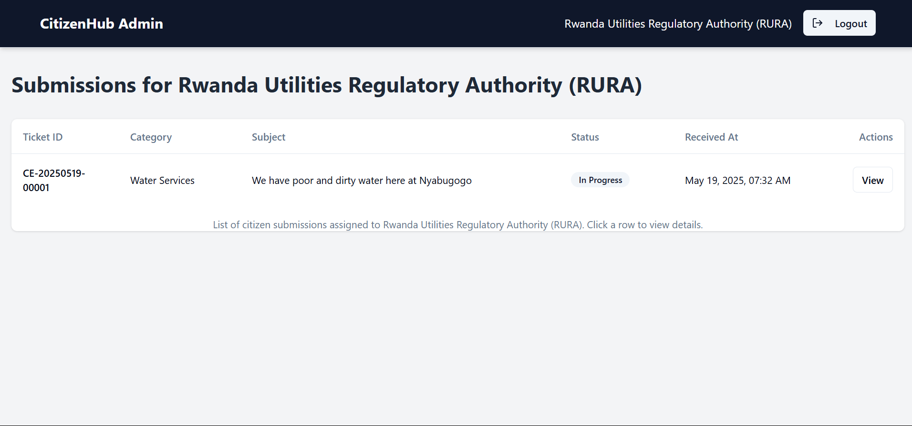
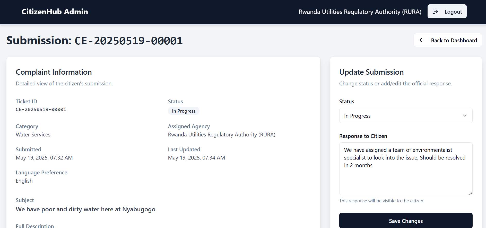

CitizenHub
==========

**A Citizen Engagement and Feedback System for Government Services in Rwanda**

CitizenHub is a platform designed to enhance communication between Rwandan citizens and government service agencies. It provides a transparent mechanism for citizens to submit feedback and complaints regarding public services and track the status of their submissions. The system aims to improve government responsiveness and leverage data for better service delivery.

Live Demo
---------

Experience CitizenHub live:

➡️ **\[[Live link:](https://citizenhub-frontend.netlify.app/)\]** ⬅️

Screenshots
-----------
Here are a few screenshots of the CitizenHub platform:

**Homepage / Submit Complaint**

**Track Submission**

**Admin Dashboard**

**Admin Submission Detail**

Features
--------

CitizenHub provides the following core functionalities:

*   **Citizen Complaint Submission:** Citizens can submit feedback or complaints through a simple online form, categorizing their submission (optional, backend logic confirms) and providing contact information.
    
*   **Submission Tracking:** Citizens receive a unique ticket ID upon submission, which they can use on a dedicated tracking page to check the real-time status and view any administrative responses.
    
*   **Admin Authentication:** Government agency administrators can securely log in to the system.
    
*   **Agency-Specific Admin Dashboard:** Authenticated administrators can view a dashboard listing all submissions assigned to their specific government agency.
    
*   **Admin Submission Management:** Administrators can view detailed information for each submission assigned to them and update its status (e.g., Received, In Progress, Resolved, Closed) and provide a response to the citizen.
    
*   **Public Statistics (Basic MVP):** A public dashboard displays basic aggregated statistics (Note: Advanced statistics display is limited in this MVP and currently has placeholder).
    

Innovation
----------

CitizenHub incorporates key features demonstrating innovation in public service delivery:

*   **Automated Categorization (Backend):** The system includes logic to automatically categorize citizen submissions based on the text of the complaint, helping to route them efficiently to the appropriate agency.
    
*   **Transparency through Tracking:** Providing citizens with a public-facing tracking mechanism for their specific submission enhances transparency in the feedback process.
    
*   **Data Aggregation for Insights:** The backend aggregates submission data, laying the groundwork for future analysis and a public statistics view to inform service improvements (currently shows placeholder stats in MVP frontend).
    

Technology Stack
----------------

CitizenHub is built using a modern full-stack architecture:

*   **Backend:** Node.js with Express.js framework for the API, Sequelize ORM for database interaction, PostgreSQL database. Includes middleware for authentication (JWT) and authorization. Uses libraries for tasks like password hashing (bcrypt) and request validation (Joi).
    
*   **Frontend:** React application for the user interface, styled using Tailwind CSS and ShadCN UI components. Uses Axios for API communication and React Router for navigation.
    
*   **Deployment:** The frontend is deployed on Netlify, and the backend and PostgreSQL database are hosted on Render.
    

Getting Started (Local Development)
-----------------------------------

To set up and run CitizenHub on your local machine:

1.  git clone https://github.com/patrickthe1/citizen-engagement-rw.git cd citizen-engagement-rw
    
2.  git submodule update --init --recursive
    
3.  cd backend# Follow instructions in backend/README.md
    
4.  cd ../frontend# Follow instructions in frontend/README.md
    
5.  **Start Services:** From the root directory of the project, start both the backend and frontend development servers (instructions in respective READMEs).
    

Deployment
----------

The CitizenHub MVP is deployed online for easy access and testing. The frontend is hosted on Netlify, and the backend API and PostgreSQL database are hosted on Render.

For detailed steps on how the application was deployed, please refer to the deployment sections within the backend/README.md and frontend/README.md files, which describe the configuration steps on Render and Netlify.

The live demo link is available at the top of this README.

Walkthrough for Reviewers
-------------------------

Follow these steps to quickly explore the core functionality of the deployed CitizenHub system:

1.  **Access the Platform:** Go to the live demo URL: **\[[Live link](https://citizenhub-frontend.netlify.app)\]**.
    
2.  **Submit a Complaint:**
    
    *   On the homepage, fill out the "Submit Your Feedback or Complaint" form.
        
    *   Enter a Subject and a Description (required). Use text that might trigger a specific category based on keywords (e.g., mention "water outage" or "clinic wait time").
        
    *   (Optional) Select a Category from the dropdown. Note how the backend prioritizes your selection if provided.
        
    *   (Optional) Provide Contact Information and Language Preference.
        
    *   Click "Submit Complaint".
        
    *   **Note the Ticket ID** displayed on the success message.
        
3.  **Track the Complaint:**
    
    *   Click "Track Existing Complaint" or manually navigate to the Tracking page.
        
    *   Enter the Ticket ID you received in the previous step.
        
    *   Click "Track Submission".
        
    *   Verify that the submission details and current status ("Received") are displayed.
        
4.  **View Public Statistics (Basic):**
    
    *   Click "View Statistics" or manually navigate to the Statistics page.
        
    *   Observe the basic statistics displayed (currently only Total Submissions count is guaranteed functional in the MVP UI).
        
5.  **Explore Admin Functionality:**
    
    *   Manually navigate to the Admin Login page: **\[[Admin Login](https://citizenhub-frontend.netlify.app)\]/admin/login**.
        
    *   Log in with sample admin credentials for a test agency (e.g., for the RURA agency):
        
        *   **Username:** rura\_admin
            
        *   **Password:** password123 
            
    *   Verify that you are redirected to the Admin Dashboard for the RURA agency.
        
    *   See the list of submissions assigned to RURA. Note that the list is filtered by agency.
        
    *   Click on any submission in the list.
        
    *   Verify that the Admin Submission Detail page loads, showing all details for that submission.
        
    *   In the update form, change the Status (e.g., from "Received" to "In Progress") and add text in the Admin Response field (e.g., "We are looking into this.").
        
    *   Click "Update Status".
        
    *   Verify the success notification appears.
        
    *   (Optional) Log out by manually navigating away or implementing a logout button.
        

This walkthrough demonstrates the core citizen and admin workflows and highlights key features for reviewers.

Known Limitations (MVP)
-----------------------

*   The Public Statistics Dashboard currently only displays the placeholder stats. Displaying statistics broken down by status and category requires further frontend implementation and a more sophisticated backend endpoint than the current api/stats/summary.
    
*   The backend session management uses a simple MemoryStore, which is not suitable for production.
    
*   Frontend authentication relies on localStorage for persistence, which is an MVP approach.
    
*   The AI categorization is based on basic keyword matching and can be improved with more advanced NLP techniques.
    
*   Admin roles and permissions are basic (only one 'admin' role with agency filtering).
    

Future Improvements
-------------------

*   Enhance the Public Statistics Dashboard with interactive charts and more detailed data visualizations.
    
*   Implement a more robust session/authentication management system (e.g., using a database session store, refreshing JWTs, or a dedicated auth service).
    
*   Develop more sophisticated AI/NLP for categorization.
    
*   Implement different admin roles and more granular permissions.
    
*   Add features for citizens to like to receive notifications.
    
*   Develop a more comprehensive admin interface with search, filtering, and reporting capabilities.

    

License
-------

\[\MIT\]